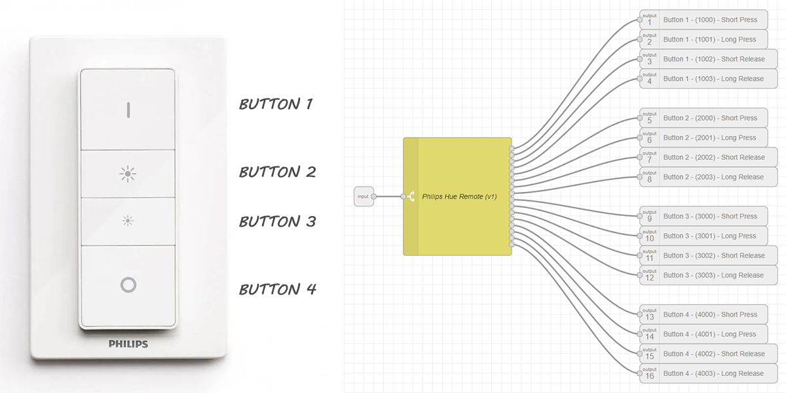
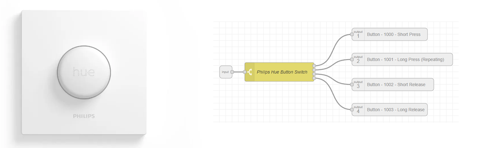

You can read more about how I am using these from [Node-RED | Ikea and Hue Switches for Home Assistant](https://lab.evishome.com/node-red-switches-for-ha/)

## Subflow - Philips Hue Dimmer Switch (v1) - switch node
[Philips Hue Dimmer Switch (v1) subflow (json)](https://github.com/EvisHome/Node-RED/blob/main/Dimmer-Switches/Subflow-Philips-Hue-Dimmer-Switch.json)

## Subflow - Philips Hue Button - switch node
[Philips Hue Button subflow (json)](https://github.com/EvisHome/Node-RED/blob/main/Dimmer-Switches/Subflow-Philips-Hue-Button.json)

