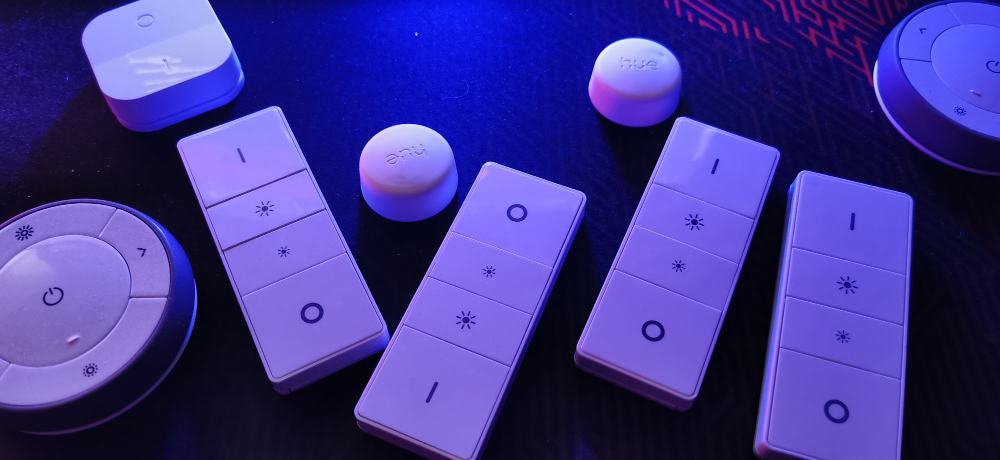

# Ikea and Hue Switches for Home Assistant

You can read more about how I am using these from [Node-RED | Ikea and Hue Switches for Home Assistant](https://lab.evishome.com/node-red-switches-for-ha/)

## Subflow - Philips Hue Dimmer Switch (v1) - switch node
[Philips Hue Dimmer Switch (v1) subflow (json)](https://github.com/EvisHome/Node-RED/blob/main/Dimmer-Switches/Subflow-Philips-Hue-Dimmer-Switch.json)

## Subflow - Philips Hue Button - switch node
[Philips Hue Button subflow (json)](https://github.com/EvisHome/Node-RED/blob/main/Dimmer-Switches/Subflow-Philips-Hue-Button.json)

## Subflow - Ikea Trådfri Dimmer Switch - switch node
[Ikea Trådfri Dimmer Switch subflow (json)](https://github.com/EvisHome/Node-RED/blob/main/Dimmer-Switches/Subflow-Ikea-Trådfri-Dimmer-Switch.json)

## Subflow - Ikea Trådfri On/Off Switch - switch node
[Ikea Trådfri On/Off Switch subflow (json)](https://github.com/EvisHome/Node-RED/blob/main/Dimmer-Switches/Subflow-Ikea-Trådfri-On-Off-Switch.json)

## Subflow - Remote Switch Button Press Loop
To mimic the hue 5 press function, I created a subflow "Remote Press Mode Loop", there might be better ways to do this, and with fewer nodes, but this is what I came up with at the time and works well for me. The function has two variable that can be set. The number of presses (or modes) you want to loop through. The reset time for the loop, meaning the time in seconds that it will wait for sequential presses before the loop is reset and it will start counting presses from the beginning.

